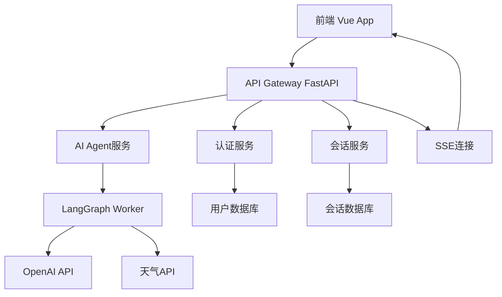

# Design Document

## Overview

本设计文档描述了一个完整的AI Agent应用的技术架构，包含前后端分离的设计方案。应用采用FastAPI作为后端框架，结合LangGraph构建智能对话Agent，前端使用Vue 3 + Tailwind CSS + shadcn/ui构建现代化用户界面。系统核心功能包括RBAC认证、会话管理、流式对话和天气查询Agent。

## Code Reuse Analysis

由于这是一个新项目，我们将建立标准的现代Web应用架构，遵循最佳实践。

### Technology Stack Foundation
- **后端框架**: FastAPI (高性能Python API框架)
- **AI框架**: LangGraph (用于构建AI Agent工作流)
- **数据库**: SQLite (开发阶段) / PostgreSQL (生产环境)
- **前端框架**: Vue 3 (Composition API)
- **CSS框架**: Tailwind CSS
- **UI组件**: shadcn/ui (Vue版本)
- **包管理**: uv (Python) + npm (Node.js)

### Integration Points
- **OpenAI API**: 通过LangGraph集成GPT模型
- **天气API**: 集成第三方天气服务
- **SSE**: 用于实时流式数据传输
- **JWT**: 用于用户认证和会话管理

## Architecture

系统采用前后端分离的微服务架构，支持水平扩展和模块化开发。

### Modular Design Principles
- **Single File Responsibility**: API路由、数据模型、服务逻辑分别独立文件
- **Component Isolation**: 前端组件按功能域划分，后端按业务逻辑分层
- **Service Layer Separation**: 清晰划分数据访问层、业务逻辑层、API层
- **Utility Modularity**: 工具函数按用途分类，独立可测试



## Components and Interfaces

### 后端组件

#### 1. 认证服务 (auth_service)
- **Purpose:** 处理用户注册、登录、权限验证
- **Interfaces:** 
  - POST /auth/login
  - POST /auth/register
  - GET /auth/me
  - POST /auth/logout
- **Dependencies:** 数据库ORM、JWT库
- **Models:** User, Role, Permission

#### 2. 会话服务 (chat_service)
- **Purpose:** 管理用户会话历史和上下文
- **Interfaces:**
  - GET /chat/sessions
  - POST /chat/sessions
  - GET /chat/sessions/{id}/messages
  - DELETE /chat/sessions/{id}
- **Dependencies:** 数据库ORM、认证中间件
- **Models:** ChatSession, Message

#### 3. AI Agent服务 (agent_service)
- **Purpose:** 核心AI对话逻辑，集成LangGraph
- **Interfaces:**
  - POST /agent/chat (SSE流式响应)
  - GET /agent/thinking/{message_id}
- **Dependencies:** LangGraph、OpenAI客户端、天气API
- **Models:** AgentState, ThinkingStep

#### 4. 天气查询工具 (weather_tool)
- **Purpose:** 为Agent提供天气查询功能
- **Interfaces:** 内部工具接口
- **Dependencies:** 第三方天气API客户端
- **Models:** WeatherData, Location

### 前端组件

#### 1. 认证组件 (AuthComponents)
- **Purpose:** 用户登录注册界面
- **Components:** LoginForm, RegisterForm, AuthGuard
- **Dependencies:** Vue Router、状态管理
- **Reuses:** shadcn/ui表单组件

#### 2. 聊天界面 (ChatComponents)
- **Purpose:** 主要对话界面
- **Components:** ChatWindow, MessageList, InputArea, ThinkingDisplay
- **Dependencies:** SSE客户端、状态管理
- **Reuses:** shadcn/ui对话框组件

#### 3. 会话历史 (SessionComponents)
- **Purpose:** 会话管理和历史查看
- **Components:** SessionList, SessionDetail, SessionSearch
- **Dependencies:** API客户端
- **Reuses:** shadcn/ui列表组件

## Data Models

### 用户认证模型

```python
# User Model
class User:
    id: UUID
    username: str
    email: str
    password_hash: str
    role_id: UUID
    created_at: datetime
    is_active: bool

class Role:
    id: UUID
    name: str  # 'admin', 'user'
    permissions: List[str]

class Session:
    id: UUID
    user_id: UUID
    token: str
    expires_at: datetime
```

### 会话管理模型

```python
# Chat Models
class ChatSession:
    id: UUID
    user_id: UUID
    title: str
    created_at: datetime
    updated_at: datetime
    is_archived: bool

class Message:
    id: UUID
    session_id: UUID
    content: str
    role: str  # 'user', 'assistant', 'system'
    thinking_steps: Optional[List[ThinkingStep]]
    created_at: datetime

class ThinkingStep:
    id: UUID
    message_id: UUID
    step_type: str  # 'analysis', 'planning', 'execution'
    content: str
    order: int
```

### AI Agent模型

```python
# Agent Models
class AgentState:
    current_session: UUID
    message_history: List[Message]
    context_window: List[Message]  # 最近10轮对话
    weather_context: Optional[WeatherData]

class WeatherData:
    location: str
    temperature: float
    description: str
    humidity: int
    timestamp: datetime
```

## Error Handling

### 错误场景处理

1. **认证失败**
   - **Handling:** 返回401状态码，清除客户端token
   - **User Impact:** 跳转到登录页面，显示友好错误信息

2. **API限流**
   - **Handling:** 返回429状态码，实现指数退避重试
   - **User Impact:** 显示"系统繁忙，请稍后重试"提示

3. **OpenAI API失败**
   - **Handling:** 记录错误日志，返回降级响应
   - **User Impact:** 显示"AI服务暂时不可用，请稍后重试"

4. **SSE连接中断**
   - **Handling:** 自动重连机制，最多重试3次
   - **User Impact:** 显示连接状态，自动恢复对话

5. **天气API失败**
   - **Handling:** 返回缓存数据或提示用户重试
   - **User Impact:** 显示"天气数据暂时不可用"

## Testing Strategy

### 单元测试
- **后端**: 使用pytest测试API端点、业务逻辑、数据模型
- **前端**: 使用Vitest测试Vue组件、工具函数
- **覆盖率**: 目标90%以上代码覆盖率

### 集成测试
- **API集成**: 测试完整的请求-响应流程
- **数据库集成**: 测试ORM操作和数据一致性
- **AI Agent集成**: 测试LangGraph工作流执行

### 端到端测试
- **用户认证流程**: 注册→登录→授权验证
- **完整对话流程**: 发送消息→AI响应→历史记录
- **天气查询流程**: 询问天气→API调用→结果展示

## 部署和环境配置

### 环境变量配置
```bash
# OpenAI配置
OPENAI_API_KEY=sk-...
OPENAI_API_URL=https://api.openai.com/v1
OPENAI_MODEL=gpt-4

# 数据库配置
DATABASE_URL=sqlite:///./ai_agent.db

# 天气API配置
WEATHER_API_KEY=...
WEATHER_API_URL=...

# JWT配置
SECRET_KEY=...
ACCESS_TOKEN_EXPIRE_MINUTES=30

# 服务配置
HOST=0.0.0.0
PORT=8000
DEBUG=False
```

### 项目结构
```
ai-agent/
├── backend/
│   ├── app/
│   │   ├── api/          # API路由
│   │   ├── core/         # 核心配置和工具
│   │   ├── models/       # 数据模型
│   │   ├── services/     # 业务逻辑层
│   │   ├── agents/       # LangGraph Agent
│   │   └── tools/        # Agent工具
│   ├── tests/
│   ├── requirements.txt
│   └── main.py
├── frontend/
│   ├── src/
│   │   ├── components/   # Vue组件
│   │   ├── views/        # 页面视图
│   │   ├── stores/       # 状态管理
│   │   ├── services/     # API客户端
│   │   └── utils/        # 工具函数
│   ├── tests/
│   ├── package.json
│   └── vite.config.ts
└── docs/
```